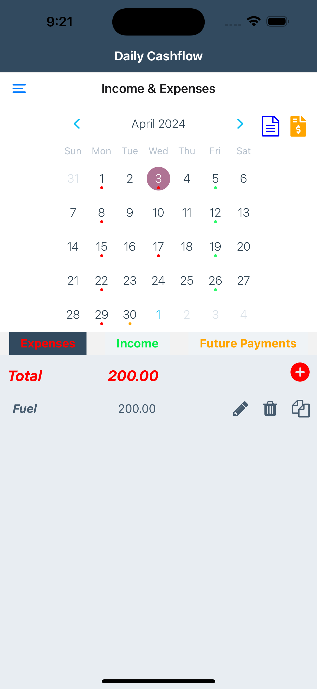
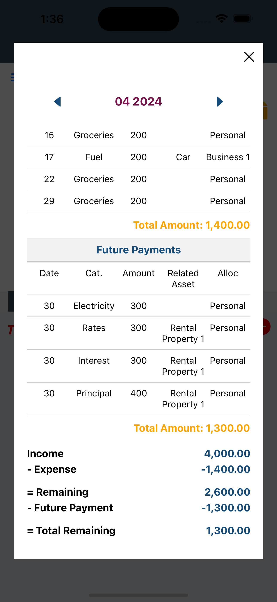
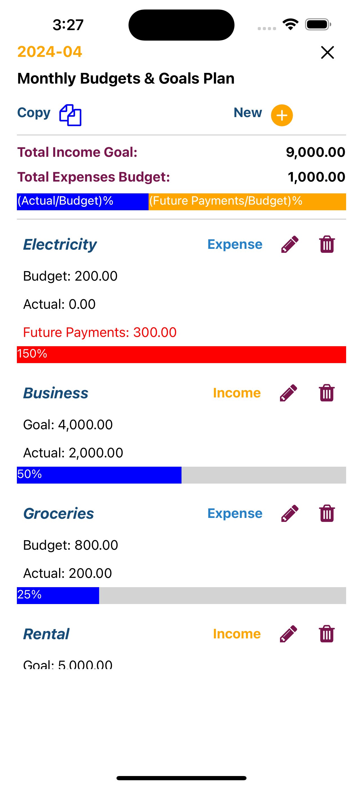

 # Income & Expenses  

 

**Red, green, and orange dots represent expenses, income, and future payments respectively.**

**Click on a day on the calendar and the cash flow records for that day will be displayed at the bottom.**

## Monthly Information

**Click the Blue Icon, it will show the Monthly Information.**

**Click the arrows of the monthly calendar to display information for other months.**

## Monthly Budgets & Goals Plan

